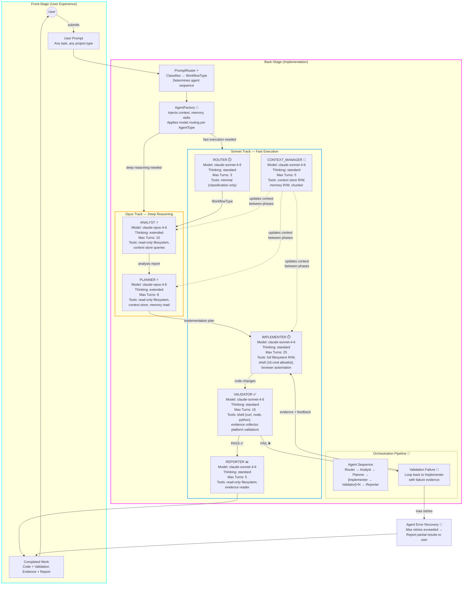

# ACLI v2 Agent Model Routing

**Type:** Architecture Diagram
**Last Updated:** 2026-03-19
**Related Files:**
- `src/acli/agents/definitions.py`
- `src/acli/agents/factory.py`
- `src/acli/core/orchestrator_v2.py`

## Purpose

Shows how each of the 7 agent types is routed to the optimal Claude model — Opus for deep reasoning tasks (analysis, planning) and Sonnet for fast execution tasks (implementation, validation) — with per-agent configuration of thinking mode, max turns, and tool sets.

## Diagram

## Key Insights

- **User Impact 1:** The user gets high-quality analysis and planning (Opus handles the hard thinking) without paying Opus costs for every agent — only 2 of 7 agents use Opus, keeping cost proportional to reasoning depth.
- **User Impact 2:** The Implementer-Validator loop runs on fast Sonnet with up to 25 turns, so iterative code-and-validate cycles complete quickly rather than bottlenecking on expensive model calls.
- **Technical Enabler:** Per-agent tool scoping limits blast radius — the Router gets classification-only tools (3 max turns), the Implementer gets full filesystem + shell, and the Validator gets evidence collection tools. No agent has more power than its role requires.

## Change History

- **2026-03-19:** Initial creation (v2 bootstrap)
