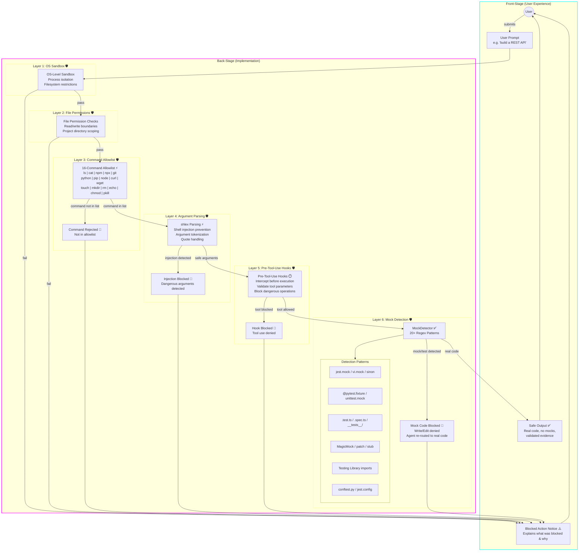

# ACLI v2 Security — Defense-in-Depth

**Type:** Architecture Diagram
**Last Updated:** 2026-03-19
**Related Files:**
- `src/acli/security/validators.py`
- `src/acli/security/hooks.py`
- `src/acli/validation/mock_detector.py`

## Purpose

Shows the 6 layered security barriers that protect the user's system from dangerous agent actions — each layer catches threats the previous one missed, ensuring no single bypass compromises safety.

## Diagram

## Key Insights

- **User Impact 1:** The user never sees a dangerous command execute — 6 layers guarantee that even if an agent hallucinates `rm -rf /` or tries shell injection, it gets caught before execution.
- **User Impact 2:** Mock detection ensures the user always gets real, functional code — agents cannot sneak in `jest.mock()`, `unittest.mock`, or test doubles that would pass fake validation.
- **Technical Enabler:** Each layer is independent. The command allowlist catches broad categories (only 16 commands allowed), shlex catches injection within allowed commands, hooks catch semantic misuse of allowed tools, and mock detection catches code-level cheating. No single bypass defeats all layers.

## Change History

- **2026-03-19:** Initial creation (v2 bootstrap)
