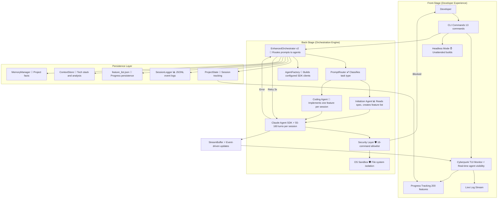

# ACLI v2 System Architecture

**Type:** Architecture Diagram
**Last Updated:** 2026-03-19
**Related Files:**
- `src/acli/cli.py`
- `src/acli/core/orchestrator_v2.py`
- `src/acli/core/agent.py`
- `src/acli/core/client.py`
- `src/acli/core/session.py`
- `src/acli/core/streaming.py`
- `src/acli/tui/app.py`
- `src/acli/security/validators.py`

## Purpose

Shows how a developer's project spec flows through ACLI's multi-agent orchestration to produce a working codebase, with security enforcement at every tool call and real-time visibility via the cyberpunk TUI.

## Diagram

## Key Insights

- **Autonomous Building**: Developer provides a spec, ACLI handles the entire build lifecycle across multiple agent sessions
- **Defense in Depth**: Four security layers (OS sandbox, file permissions, command allowlist, pre-tool hooks) protect against agent misuse
- **Real-time Visibility**: StreamBuffer feeds the TUI with live tool calls, text output, and progress without blocking agent execution
- **Resumable State**: JSONL logs + feature_list.json enable crash recovery and session replay

## Change History

- **2026-03-19:** Initial creation after E2E validation (200/200 features, 370 turns, $17.46)
