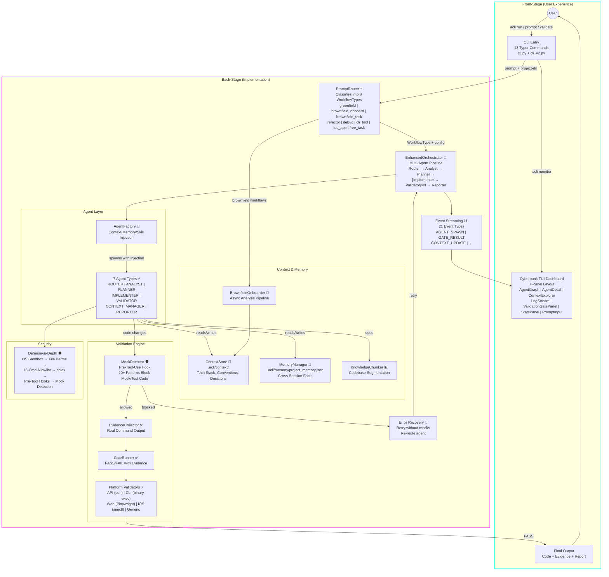

# ACLI v2 System Overview

**Type:** Architecture Diagram
**Last Updated:** 2026-03-19
**Related Files:**
- `src/acli/cli.py`
- `src/acli/cli_v2.py`
- `src/acli/core/orchestrator_v2.py`
- `src/acli/routing/router.py`
- `src/acli/agents/definitions.py`
- `src/acli/validation/engine.py`
- `src/acli/tui/app.py`

## Purpose

Shows how a user's prompt flows from CLI entry through routing, orchestration, agent execution, and validation — with the TUI providing real-time monitoring at every stage.

## Diagram

## Key Insights

- **User Impact 1:** A single prompt triggers the full pipeline — the user never manually coordinates agents, validation, or context loading.
- **User Impact 2:** The TUI streams 21 event types in real time, so the user sees exactly which agent is active, what validation gates passed/failed, and what context was loaded.
- **Technical Enabler:** The PromptRouter's 8 workflow types mean the same CLI handles greenfield apps, brownfield tasks, debugging, refactoring, and platform-specific work (iOS, CLI, Web) without the user specifying a mode.

## Change History

- **2026-03-19:** Initial creation (v2 bootstrap)
