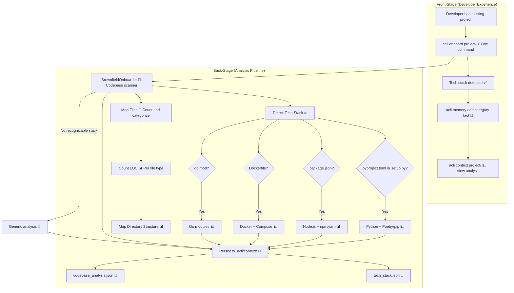

# Brownfield Codebase Onboarding

**Type:** Feature Diagram
**Last Updated:** 2026-03-19
**Related Files:**
- `src/acli/cli.py` (onboard command)
- `src/acli/context/onboarder.py`
- `src/acli/context/store.py`
- `src/acli/context/memory.py`

## Purpose

Enables developers to bring existing projects into ACLI by automatically analyzing the codebase's tech stack, structure, and patterns — creating context that helps the agent make better decisions.

## Diagram

## Key Insights

- **Zero-Config Detection**: Automatically identifies Python/Node/Docker/Go from project files
- **Persistent Context**: Analysis stored in `.acli/context/` survives across sessions
- **Memory System**: Developers can annotate with facts (`acli memory add`) that agents access later
- **E2E Validated**: Successfully onboarded ALR project (26 files, 3,574 LOC, Python/Docker/Poetry detected)

## Change History

- **2026-03-19:** Initial creation; validated with ALR brownfield onboarding
