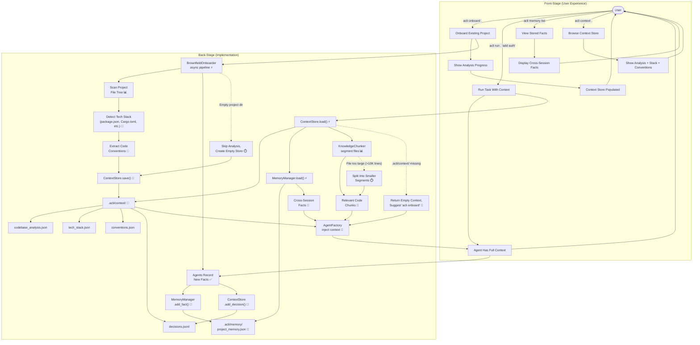

# Context & Memory System

**Type:** Feature Diagram
**Last Updated:** 2026-03-19
**Related Files:**
- `src/acli/context/store.py`
- `src/acli/context/memory.py`
- `src/acli/context/chunker.py`
- `src/acli/context/onboarder.py`

## Purpose

Gives agents persistent knowledge about the codebase and cross-session memory so they never start from scratch, reducing redundant analysis and enabling intelligent decisions based on project history.

## Diagram

## Key Insights

- **Never Start From Scratch:** After onboarding, every agent session loads the project's tech stack, conventions, and historical decisions. Session 10 is as informed as session 1.
- **Memory Compounds Value:** Facts recorded by one agent (e.g., "this project uses PostgreSQL with pgvector") are available to all future agents, building institutional knowledge over time.
- **Technical Enabler:** The 4-file context store (analysis, stack, conventions, decisions) separates concerns so agents can load only what they need, keeping prompt sizes manageable.

## Change History

- **2026-03-19:** Initial creation (v2 bootstrap)
