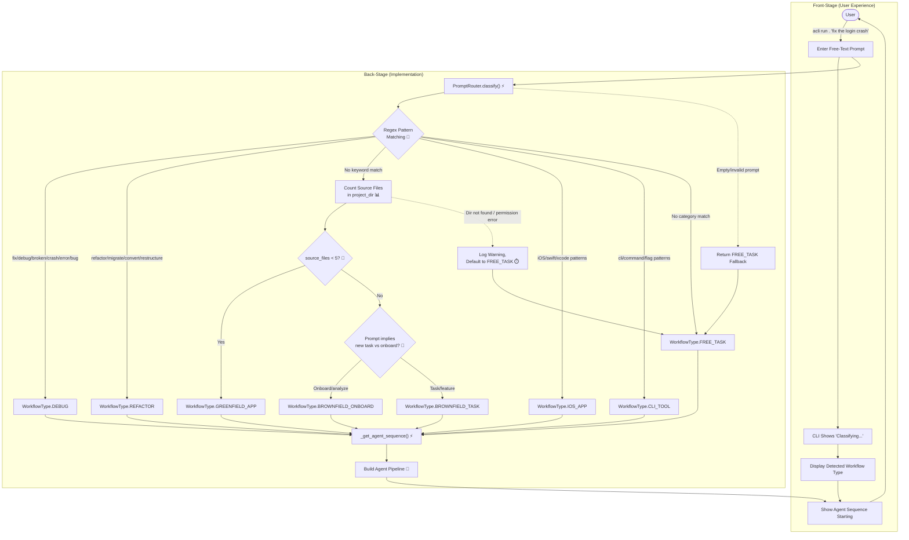

# Prompt Routing Engine

**Type:** Feature Diagram
**Last Updated:** 2026-03-19
**Related Files:**
- `src/acli/routing/router.py`
- `src/acli/routing/workflows.py`

## Purpose

Classifies any free-text user prompt into one of 8 typed workflows so the correct agent sequence is spawned automatically, eliminating manual configuration for every project type.

## Diagram

## Key Insights

- **Zero Config for Users:** Users type natural language; no YAML, no workflow selection menus. The router handles everything from "fix the crash" to "build me an iOS app."
- **Graceful Fallback:** Unrecognizable prompts and errors always land on FREE_TASK rather than failing, so the system never blocks the user.
- **Technical Enabler:** Regex-first classification is fast (sub-millisecond) and deterministic. File counting for brownfield detection avoids expensive AST parsing at the routing stage.

## Change History

- **2026-03-19:** Initial creation (v2 bootstrap)
