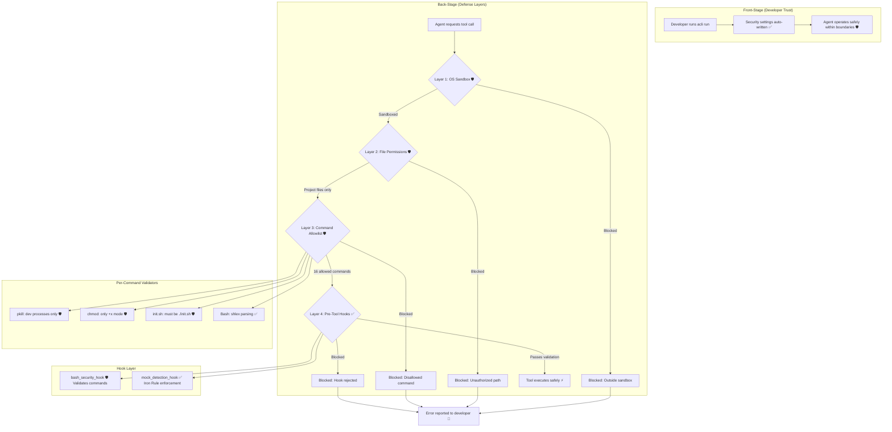

# Defense-in-Depth Security Model

**Type:** Feature Diagram
**Last Updated:** 2026-03-19
**Related Files:**
- `src/acli/security/validators.py`
- `src/acli/security/hooks.py`
- `src/acli/core/client.py`
- `src/acli/validation/mock_detector.py`

## Purpose

Protects developers from agent misuse by enforcing four layers of security on every tool call, ensuring the autonomous agent cannot execute dangerous commands, access unauthorized files, or bypass validation.

## Diagram

## Key Insights

- **16-Command Allowlist**: Only ls, cat, npm, npx, git, python, pip, node, curl, wget, touch, mkdir, rm, echo, chmod, pkill are allowed
- **Per-Command Validation**: pkill only kills dev processes (node, npm, vite, webpack); chmod only allows +x
- **Iron Rule**: Mock detection hook blocks creation of test/mock files, enforcing real system validation
- **Zero-Config**: Security settings are auto-written to `.claude_settings.json` on every session start

## Change History

- **2026-03-19:** Initial creation
