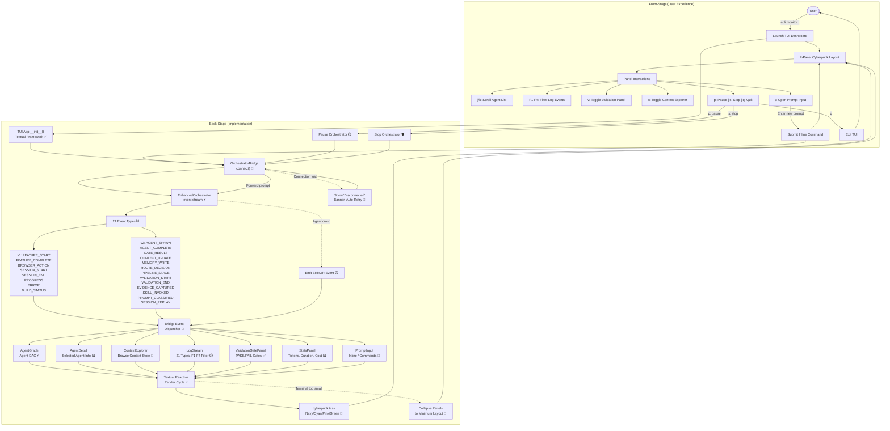

# TUI Dashboard

**Type:** Feature Diagram
**Last Updated:** 2026-03-19
**Related Files:**
- `src/acli/tui/app.py`
- `src/acli/tui/bridge.py`
- `src/acli/tui/widgets.py`
- `src/acli/tui/prompt_input.py`
- `src/acli/tui/cyberpunk.tcss`

## Purpose

Provides real-time visibility into the multi-agent orchestration pipeline through a 7-panel cyberpunk terminal UI, so users can monitor, steer, and debug autonomous coding sessions without leaving the terminal.

## Diagram

## Key Insights

- **Full Visibility Without Context Switching:** Users see agent DAGs, validation gates, context state, and cost metrics in one terminal screen. No browser tabs, no log file tailing.
- **Interactive Steering:** The inline prompt input (`/`) and pause/stop controls let users redirect or halt autonomous work in real-time rather than waiting for completion.
- **Technical Enabler:** The OrchestratorBridge decouples the TUI from the orchestrator, so the 21 event types flow through a single dispatch path and panels subscribe to only the events they need.

## Change History

- **2026-03-19:** Initial creation (v2 bootstrap)
