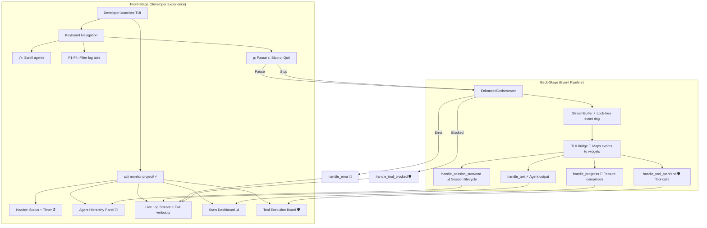

# Cyberpunk TUI Agent Monitor

**Type:** Feature Diagram
**Last Updated:** 2026-03-19
**Related Files:**
- `src/acli/tui/app.py`
- `src/acli/tui/bridge.py`
- `src/acli/tui/widgets.py`
- `src/acli/tui/cyberpunk.tcss`
- `src/acli/core/streaming.py`

## Purpose

Gives developers real-time visibility into autonomous agent activity through a full-screen terminal dashboard, replacing opaque log output with an interactive monitoring experience.

## Diagram

## Key Insights

- **4 FPS Refresh**: TUI updates at 4 frames per second for smooth real-time display without CPU overhead
- **Event-Driven**: StreamBuffer decouples agent execution from TUI rendering, preventing blocking
- **Keyboard-First**: All controls accessible via single keystrokes (j/k/p/s/q/F1-F4)
- **Dual Mode**: `--attach` runs orchestrator alongside TUI; `--detached` views existing state

## Change History

- **2026-03-19:** Initial creation; TUI verified via tmux capture (45 lines, header rendered)
