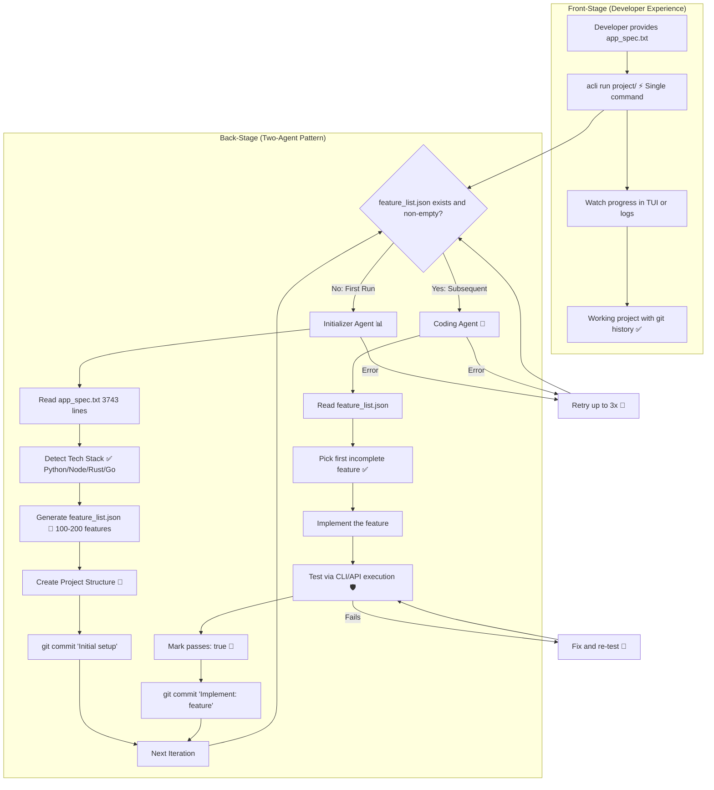

# Two-Agent Build Pattern

**Type:** Feature Diagram
**Last Updated:** 2026-03-19
**Related Files:**
- `src/acli/core/orchestrator_v2.py`
- `src/acli/core/session.py`
- `src/acli/prompts/templates/initializer.md`
- `src/acli/prompts/templates/coding.md`

## Purpose

Enables developers to build entire projects from a plain-English spec by splitting the work into two specialized agent roles: an initializer that plans the project and a coder that implements features one at a time.

## Diagram

## Key Insights

- **Spec-Driven**: A 3,743-line spec produced 200 features, 25 source files, and 3,564 LOC across 4 sessions
- **Tech-Stack Adaptive**: Templates detect Python/Node/Rust/Go from the spec and create appropriate project structure
- **Incremental Progress**: Each coding session implements exactly one feature, making progress resumable after crashes
- **Real Git History**: Every feature gets its own commit, producing a clean, reviewable git log

## Change History

- **2026-03-19:** Initial creation; validated with ALR build (200/200 features, $17.46)
