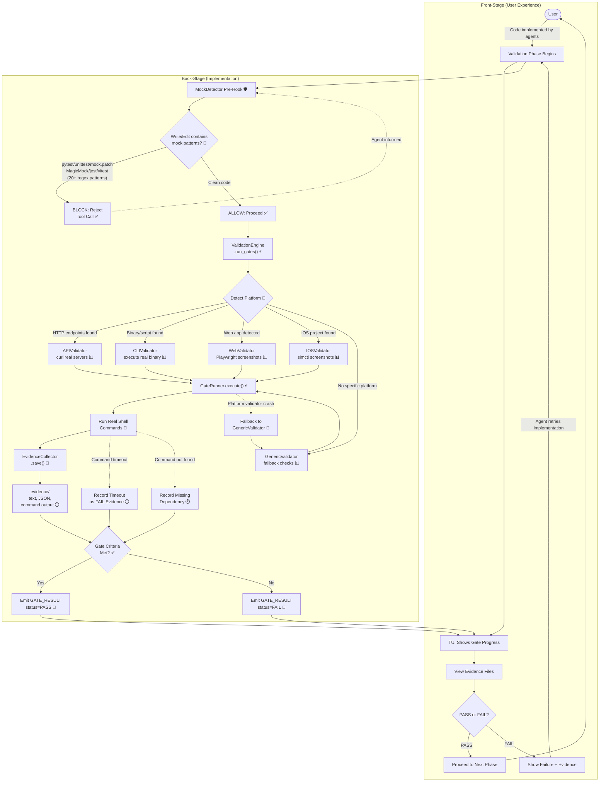

# Validation Engine

**Type:** Feature Diagram
**Last Updated:** 2026-03-19
**Related Files:**
- `src/acli/validation/engine.py`
- `src/acli/validation/gates.py`
- `src/acli/validation/evidence.py`
- `src/acli/validation/mock_detector.py`
- `src/acli/validation/platforms/api.py`
- `src/acli/validation/platforms/cli.py`
- `src/acli/validation/platforms/web.py`
- `src/acli/validation/platforms/ios.py`
- `src/acli/validation/platforms/generic.py`

## Purpose

Enforces that every implementation is validated against real running systems with captured evidence, blocking mock/test code creation so agents can never cheat their way to a passing grade.

## Diagram

## Key Insights

- **No Cheating Possible:** MockDetector intercepts tool calls before they execute, so agents cannot create pytest files, jest configs, or any test doubles. Validation only passes with real system evidence.
- **Evidence is Permanent:** Every gate execution produces evidence files (curl output, screenshots, exit codes) stored under `evidence/`, providing an audit trail the user can inspect.
- **Technical Enabler:** Platform-specific validators mean the same engine works for web apps (Playwright), APIs (curl), CLIs (binary exec), and iOS (simctl) without the user configuring anything.

## Change History

- **2026-03-19:** Initial creation (v2 bootstrap)
