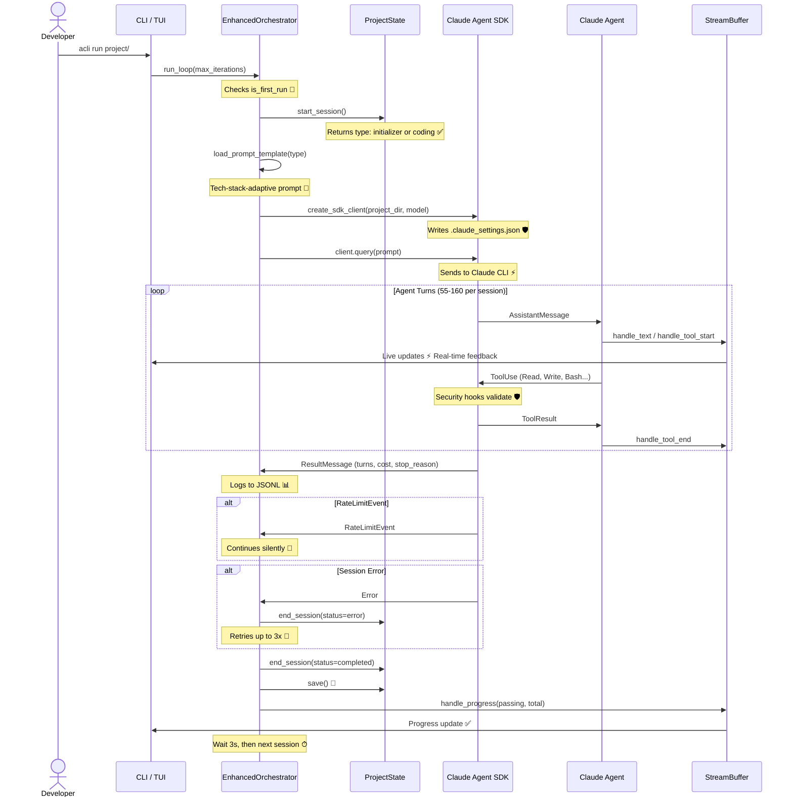

# Agent Session Lifecycle

**Type:** Sequence Diagram
**Last Updated:** 2026-03-19
**Related Files:**
- `src/acli/core/orchestrator_v2.py`
- `src/acli/core/agent.py`
- `src/acli/core/client.py`
- `src/acli/core/session.py`
- `src/acli/core/streaming.py`

## Purpose

Shows the complete lifecycle of a single agent session from prompt loading through SDK interaction to state persistence, enabling developers to understand how their project gets built turn by turn.

## Diagram

## Key Insights

- **Adaptive Prompts**: Initializer vs coding prompts are selected automatically based on feature_list.json state
- **Error Resilience**: RateLimitEvent is handled gracefully; up to 3 consecutive errors before stopping
- **Live Feedback**: Every tool call and text block flows through StreamBuffer to the TUI in real-time
- **Session Cost Tracking**: ResultMessage captures exact cost and turn count per session

## Change History

- **2026-03-19:** Initial creation based on E2E validation findings
