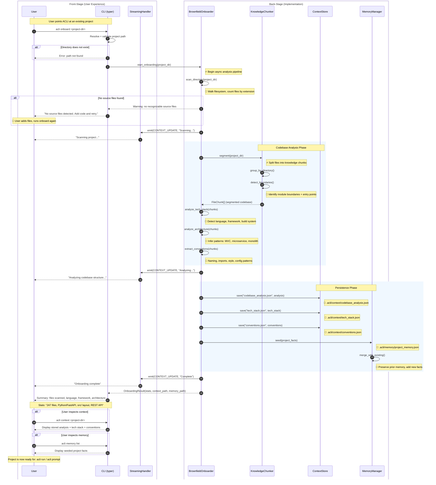

# Brownfield Onboarding Journey

**Type:** Sequence Diagram
**Last Updated:** 2026-03-19
**Related Files:**
- `src/acli/cli_v2.py`
- `src/acli/context/onboarder.py`
- `src/acli/context/chunker.py`
- `src/acli/context/store.py`
- `src/acli/context/memory.py`

## Purpose

Shows how a user onboards an existing codebase so ACLI can operate on it with full project awareness -- from the initial command through async analysis, context persistence, and memory seeding, including the error path when a project has no source files.

## Diagram

## Key Insights

- **User Impact 1:** Onboarding is a single command -- users do not manually describe their project. ACLI auto-detects language, framework, and architecture so subsequent `acli run` commands have full context.
- **User Impact 2:** The "no source files" guard prevents confusing downstream failures by catching the problem early with a clear message and recovery path.
- **Technical Enabler:** KnowledgeChunker segments the codebase into retrievable chunks before analysis, enabling the AgentFactory to inject relevant context slices into each agent's prompt rather than flooding it with the entire codebase.

## Change History

- **2026-03-19:** Initial creation (v2 bootstrap)
