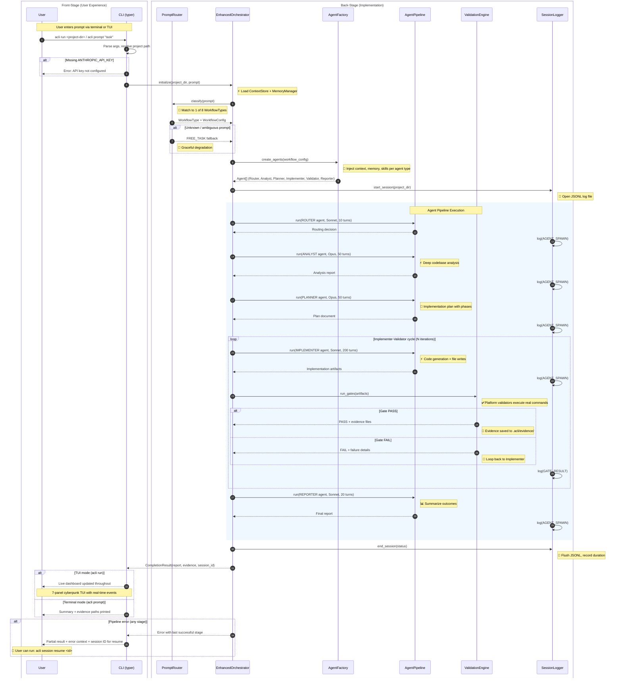

# Prompt-to-Completion Journey

**Type:** Sequence Diagram
**Last Updated:** 2026-03-19
**Related Files:**
- `src/acli/cli_v2.py`
- `src/acli/core/orchestrator_v2.py`
- `src/acli/routing/router.py`
- `src/acli/agents/factory.py`
- `src/acli/validation/engine.py`
- `src/acli/core/session.py`

## Purpose

Shows the full lifecycle from a user typing `acli run` or `acli prompt` through prompt classification, multi-agent pipeline execution, validation gates, and final result delivery -- exposing both the user-facing experience and back-stage orchestration decisions.

## Diagram

## Key Insights

- **User Impact 1:** Users never interact with agent internals -- the CLI and TUI abstract the full pipeline into a single command with live feedback or a final summary.
- **User Impact 2:** Session IDs enable resume-from-failure, so a crashed run does not lose all progress.
- **Technical Enabler:** The Implementer-Validator loop with real evidence (not mocks) ensures code actually works before the pipeline reports success. Opus handles analysis/planning; Sonnet handles high-throughput implementation.

## Change History

- **2026-03-19:** Initial creation (v2 bootstrap)
